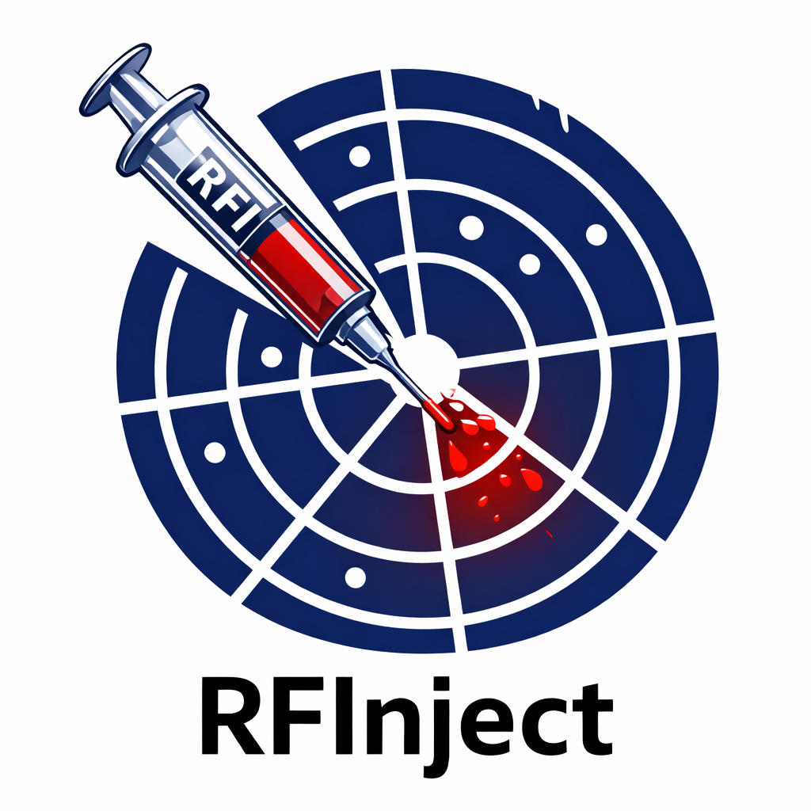

# rfinject-utils

<p align="center">
  
</p>
<p align="center">
  
</p>

<p align="center">
  <a href="https://github.com/sirbastiano/rfinject-utils/blob/main/readme.md"></a>
  <a href="https://github.com/sirbastiano/rfinject-utils/blob/main/LICENSE"></a>
  <a href="https://github.com/sirbastiano/rfinject-utils/stargazers"></a>
  <a href="https://github.com/sirbastiano/rfinject-utils/forks"></a>
  <a href="https://github.com/sirbastiano/rfinject-utils/commits"></a>
  <a href="https://github.com/sirbastiano/rfinject-utils/issues"></a>
  <a href="https://github.com/sirbastiano/rfinject-utils"></a>
</p>
<p align="center">
  <a href="https://github.com/sirbastiano/rfinject-utils"></a>
  <a href="docs/index.html"></a>
  <a href="https://huggingface.co/buckets/ESA-philab/RFInject-v1-L0"></a>
</p>

## RF RFI analysis toolkit for SAR Zarr workflows

rfinject-utils is a Python toolkit for radio-frequency interference (RFI) analysis and injection workflows on synthetic aperture radar (SAR) data.

Developed at ESA Φ-lab, it provides practical utilities for:
- Navigating complex Zarr datasets
- Handling burst-level SAR products (echo, RFI, and fused views)
- Accessing and filtering metadata at group/attribute level
- Building reproducible, analysis-ready data pipelines

Repository: [https://github.com/sirbastiano/rfinject-utils.git](https://github.com/sirbastiano/rfinject-utils.git)

## Key features

- **Structured Zarr exploration** for fast inspection of nested SAR products  
- **Burst-aware access** to echo, RFI, and fused groups  
- **Metadata extraction helpers** for consistent experiment tracking  
- **Efficient slicing utilities** for repeatable, scalable analysis  
- **Optional interactive tooling** via environment extras

## Evaluation examples

- [`notebooks/rfi_iou_evaluation.ipynb`](notebooks/rfi_iou_evaluation.ipynb): end-to-end example for evaluating burst/segment detections with IoU, precision, recall, F1, and mean IoU.

## Quick start

### 1. Install PDM

```bash
curl -sSL https://pdm-project.org/install-pdm.py | python3 -
```

### 2. Install project dependencies

```bash
pdm install
```

### 3. Install optional extras (as needed)

```bash
pdm install -G jupyter_env
pdm install -G viz
pdm install -G docs
```

## Bucket-native data access

RFInject sample products are published directly in the Hugging Face bucket
[`ESA-philab/RFInject-v1-L0`](https://huggingface.co/buckets/ESA-philab/RFInject-v1-L0).

List the top-level Zarr products:

```python
from rfinject import DEFAULT_HF_BUCKET_ID, list_hf_bucket_zarrs

products = list_hf_bucket_zarrs(DEFAULT_HF_BUCKET_ID, limit=5)
print(products)
```

Open one product for metadata-only inspection without downloading chunk payloads:

```python
from rfinject import DEFAULT_HF_BUCKET_ID, open_hf_bucket_zarr

zarr_data = open_hf_bucket_zarr(
    DEFAULT_HF_BUCKET_ID,
    "s1a-iw-raw-s-hh-20240116t204634-20240116t204707-052137-064d52.zarr",
    metadata_only=True,
)
```

Mirror a full file or a complete Zarr product locally:

```python
from rfinject import DEFAULT_HF_BUCKET_ID, download_hf_bucket_path

download_hf_bucket_path(
    DEFAULT_HF_BUCKET_ID,
    "s1a-iw-raw-s-hh-20240116t204634-20240116t204707-052137-064d52.zarr",
    "/path/to/folder",
)
```

## Basic usage

```python
from rfinject import (
    DEFAULT_HF_BUCKET_ID,
    access_attributes,
    explore_zarr_structure,
    get_burst_info,
    open_hf_bucket_zarr,
)

zarr_data = open_hf_bucket_zarr(
    DEFAULT_HF_BUCKET_ID,
    "s1a-iw-raw-s-hh-20240116t204634-20240116t204707-052137-064d52.zarr",
    metadata_only=True,
)

explore_zarr_structure(zarr_data)
burst_info = get_burst_info(zarr_data)
attrs = access_attributes(zarr_data, "burst_0")
```

Run notebook or script workflows with PDM:

```bash
pdm run python your_script.py
```

## Project structure

```text
rfinject/
├── pyproject.toml        # Project metadata and dependency definitions
├── rfinject/
│   ├── __init__.py       # Public exports
│   ├── utils.py          # Core utilities for Zarr handling
│   ├── viz.py            # Visualization helpers
├── tests/
│   └── test_utils.py     # Bucket and Zarr regression tests
└── readme.md             # Project documentation
```

## Documentation

Static docs are available at:

- `docs/index.html` (home)
- `docs/getting-started.html`
- `docs/api-reference.html`
- `docs/visualization.html`

The documentation package includes three alternate display themes (dark, cool, aurora) for different working environments.

## Development and maintenance

rfinject-utils is maintained at ESA Φ-lab to support Earth observation and radar research workflows.

## License

Apache License 2.0

## Contact

For questions and support, contact `roberto.delprete@esa.int`.
